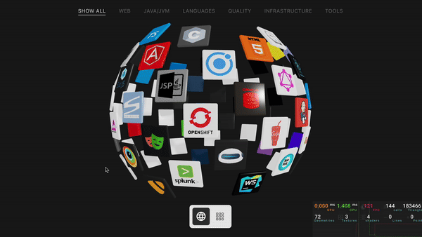

# Tech Stack Sphere

<div align="center">
  
  
  <p><em>Interactive 3D visualization built with React Three Fiber that showcases collections of logos on a rotating sphere or flat grid. Perfect for personal portfolios, company websites, or any project needing an engaging way to display technology stacks.</em></p>

[](https://www.typescriptlang.org/)
[](https://react.dev/)
[](https://vitejs.dev/)
[](https://threejs.org/)
</div>

## ✨ Features

- 🌐 **3D Sphere Visualization** - Technologies displayed on an interactive rotating sphere using Fibonacci distribution
  for even spacing
- 🔲 **Flat Grid View** - Alternative flat grid layout for easier browsing
- 🏷️ **Category Filtering** - Filter technologies by categories (Frontend, Backend, Database, etc.)
- ✨ **Smooth Transitions** - Animated transitions between sphere and flat views, and when filtering
- 🎨 **Texture Atlas** - Efficient rendering using a single texture atlas for all technology icons
- 🖱️ **Interactive Tiles** - Hover effects and click interactions for each technology

## 🚀 Quick Start

### 1. Install dependencies

```bash
npm install
```

### 2. Add your technologies

Edit `src/data/techstack.csv` with your technology data:

```csv
id;name;icon;categories;active
react;React;techstack/svg/react.svg;Frontend,Library;1
nodejs;Node.js;techstack/svg/node.js.svg;Backend,Runtime;1
typescript;TypeScript;techstack/svg/typescript.svg;Language;1
```

### 3. Add icon files

Place your technology icons in the `src/assets/techstack/` directory. Supported formats:

- PNG
- JPG/JPEG
- SVG
- GIF

### 4. Run the development server

```bash
npm run dev
```

Visit `http://localhost:5173` to see the visualization in action!

## 📦 NPM Scripts

### Development

#### `npm run dev`

Starts the development server with hot module replacement.

- Automatically generates `techstack.json` from CSV
- Runs on `http://localhost:5173`

### Build Scripts

#### `npm run build:techstack`

Converts the CSV file to JSON format. The CSV format makes it easy to maintain your technology list using any
spreadsheet application.

**Input**: `src/data/techstack.csv`

- Semicolon-delimited CSV format
- Only includes technologies where `active = 1`
- Easy to edit in Excel, Google Sheets, or text editors

**Output**: `src/data/techstack.json`

#### `npm run build:atlas`

Creates an optimized texture atlas from individual icon files for efficient GPU rendering.

**Features**:

- Combines all icons into a single WebP texture atlas
- Generates UV mappings for shader-based rendering
- Supports PNG, JPG, SVG, and GIF formats
- Creates a 10x10 grid (up to 100 technologies)

#### `npm run build`

Builds the project for production:

1. Generates techstack.json from CSV
2. Creates texture atlas
3. Runs TypeScript type checking
4. Builds with Vite

### Other Commands

- `npm run lint` - Run ESLint for code quality
- `npm run preview` - Preview production build locally

## 🏗️ Project Structure

```
src/
├── components/                       # React Three Fiber components
│   ├── TechStackSphere.tsx           # Main sphere/grid component
│   ├── Tile.tsx                      # Individual technology tile
│   └── CategoryFilter.tsx            # Category filtering UI
├── data/                             # Data files
│   ├── techstack.csv                 # Source technology data
│   ├── techstack.json                # Generated from CSV
│   └── techstack-atlas-mapping.json  # Texture atlas UV mappings
├── hooks/                            # Custom React hooks
└── scripts/                          # Build scripts
```

## 🛠️ Technology Stack

- **[React 19](https://react.dev/)** - UI library
- **[React Three Fiber](https://docs.pmnd.rs/react-three-fiber/)** - React renderer for Three.js
- **[Three.js](https://threejs.org/)** - 3D graphics library
- **[TypeScript](https://www.typescriptlang.org/)** - Type safety
- **[Vite](https://vitejs.dev/)** - Build tool
- **[Tailwind CSS](https://tailwindcss.com/)** - Utility-first CSS
- **[Sharp](https://sharp.pixelplumbing.com/)** - Image processing for texture atlas
- **[Leva](https://github.com/pmndrs/leva)** - Development GUI controls

---

<div align="center">
  <p>Give this repo a ⭐ if you find it helpful!</p>
</div>


